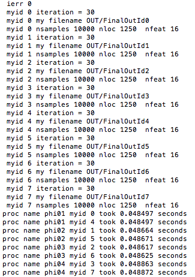

# Parallel-distributed-K-means-algorithm
The idea in this program is to adopt a distributed memory viewpoint of the k-means algorithm https://en.wikipedia.org/wiki/K-means_clustering.

## Table of contents
* [General Information](#general-information)
* [Screenshots](#screenshots)
* [File Description](#file-description)
* [Code Examples](#code-examples)
* [Contact](#contact)

## General Information
K-means clustering is an important unsupervised learning algorithm. However, the sequential k-means algorithm is inefficient to cluster the large real-world data. Thus I wrote the parallel distributed version of the K-means algorithm to decrease the wall time required.

The algorithm has two important parts in each iteration after initialization: 1). Each process will perform local operations to obtain the the counter of clusters and summation of points of different clusters. MPI_All_Reduce was used to allow the communication between processors and add up the result. 2). Reset centroids using the result from 1) in root processor, and broadcast the new centroids to every processors.

## File Description
main.c is the main driver. 

The datasets used are US pollution data from 2016, which is available on umn cselab machine. Here, I only upload the very small datesets pollution_small.csv for testing. 

The auxil1.c contains a set of auxilliary functions, which includes the parallel dirstirbuted version of k-means algorithm. 

The python script solver.py is used to check the accuracy of the program.

## Screenshots
This is a demo running on phiXX.cselabs.umn.edu clusters.
```bash
mpirun -np 8 -hostfile hostfile -map-by node  main.ex
```


## Code Examples
To build the executable program main.ex, run:
```bash
make
```
The program could be run on the phiXX.cselabs.umn.edu cluster by running:
```bash
mpirun [ -np X ] [ --hostfile <filename> ] <program>
```
where X is the number of processors, and -hostfile is used for specifying host nodes. For example:
```bash
mpirun -np 16 -hostfile hostfile -map-by node  main.ex
```
where X = 16, <filename> is hosts, and -map-by node will load balance the processes across the available nodes, numbering each process in a round-robin fashion.

To verify the correctness of the program, run:
```bash
python3 solver.py
```
The output should be
```bash
number of correct labels =  1021 / 1021
```
## Contact
Created by [liang664@umn.edu] (https://www.linkedin.com/in/buyun-liang/) - feel free to contact me if you have any questions!
